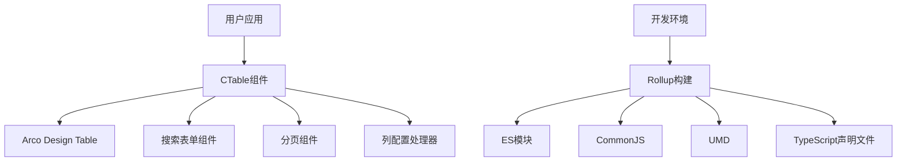
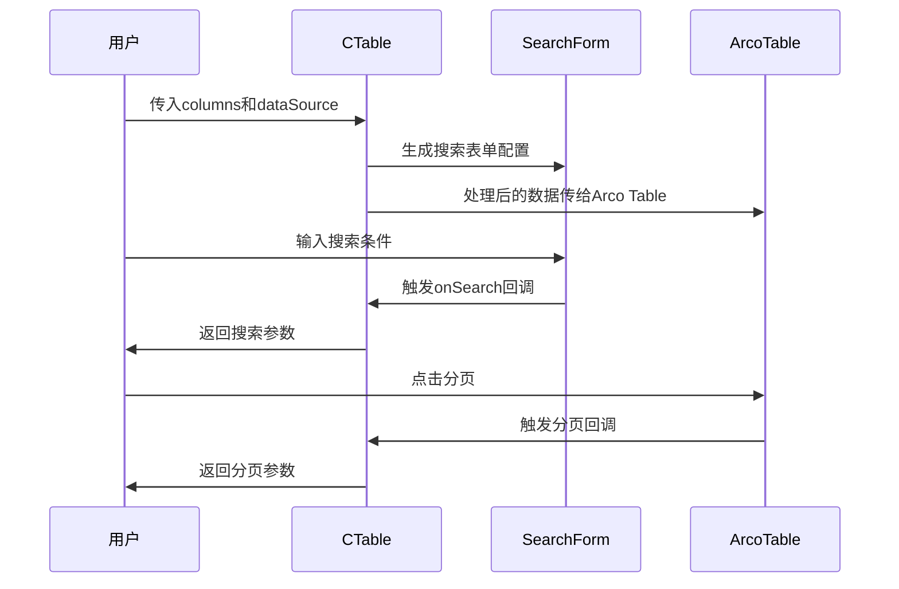

# 设计文档

## 概述

本项目将创建一个现代化的React组件库，采用TypeScript提供类型安全，使用Rollup进行高效打包。组件库基于Arco Design设计系统，首先实现CTable组件，提供类似ant-design ProTable的高级表格功能。

## 架构

### 整体架构



### 技术栈

- **核心框架**: React 18+ + TypeScript 5+
- **UI基础**: Arco Design
- **构建工具**: Rollup + 相关插件
- **开发工具**: Vite (开发服务器) + Vitest (测试)
- **代码质量**: ESLint + Prettier + Husky

## 组件和接口

### CTable组件接口

```typescript
interface CTableProps<T = any> {
  // 基础表格属性
  columns: CTableColumn<T>[];
  dataSource: T[];
  loading?: boolean;
  rowKey?: string | ((record: T) => string);
  
  // 搜索功能
  search?: {
    searchConfig?: SearchConfig[];
    onSearch?: (values: Record<string, any>) => void;
    onReset?: () => void;
    defaultCollapsed?: boolean;
  };
  
  // 分页功能
  pagination?: {
    current?: number;
    pageSize?: number;
    total?: number;
    showSizeChanger?: boolean;
    pageSizeOptions?: string[];
    onChange?: (page: number, pageSize: number) => void;
  } | false;
  
  // 表格操作
  toolBarRender?: () => React.ReactNode;
  tableAlertRender?: () => React.ReactNode;
  
  // 其他配置
  size?: 'mini' | 'small' | 'default' | 'large';
  bordered?: boolean;
  stripe?: boolean;
}

interface CTableColumn<T = any> {
  title: string;
  dataIndex: keyof T;
  key?: string;
  width?: number;
  fixed?: 'left' | 'right';
  align?: 'left' | 'center' | 'right';
  
  // 渲染相关
  render?: (value: any, record: T, index: number) => React.ReactNode;
  valueType?: 'text' | 'number' | 'date' | 'dateTime' | 'select' | 'tag';
  
  // 搜索相关
  hideInSearch?: boolean;
  searchConfig?: {
    type: 'input' | 'select' | 'dateRange' | 'numberRange';
    options?: { label: string; value: any }[];
    placeholder?: string;
  };
  
  // 排序和筛选
  sorter?: boolean | ((a: T, b: T) => number);
  filters?: { text: string; value: any }[];
  onFilter?: (value: any, record: T) => boolean;
}

interface SearchConfig {
  name: string;
  label: string;
  type: 'input' | 'select' | 'dateRange' | 'numberRange';
  options?: { label: string; value: any }[];
  placeholder?: string;
  rules?: any[];
}
```

### 核心组件结构

```
src/
├── components/
│   ├── CTable/
│   │   ├── index.tsx              # 主组件
│   │   ├── SearchForm.tsx         # 搜索表单组件
│   │   ├── TableToolbar.tsx       # 工具栏组件
│   │   ├── ColumnRenderer.tsx     # 列渲染器
│   │   └── types.ts              # 类型定义
│   └── index.ts                  # 组件导出
├── utils/
│   ├── columnUtils.ts            # 列处理工具
│   └── searchUtils.ts            # 搜索处理工具
└── index.ts                      # 库入口文件
```

## 数据模型

### 表格数据流



### 状态管理

CTable组件将使用React内置的状态管理：

- `useState` 管理搜索表单状态
- `useMemo` 优化列配置和数据处理
- `useCallback` 优化事件处理函数
- `useImperativeHandle` 暴露组件方法

## 错误处理

### 错误边界

```typescript
interface ErrorBoundaryState {
  hasError: boolean;
  error?: Error;
}

class CTableErrorBoundary extends React.Component<
  React.PropsWithChildren<{}>,
  ErrorBoundaryState
> {
  // 错误边界实现
}
```

### 错误类型

1. **数据验证错误** - columns配置不正确
2. **渲染错误** - 自定义render函数异常
3. **回调错误** - 用户提供的回调函数异常
4. **类型错误** - TypeScript类型不匹配

### 错误处理策略

- 使用ErrorBoundary包装组件
- 提供详细的错误信息和恢复建议
- 在开发环境显示详细错误，生产环境显示友好提示
- 记录错误日志便于调试

## 测试策略

### 单元测试

使用Vitest + React Testing Library：

```typescript
// 测试用例示例
describe('CTable', () => {
  it('should render basic table', () => {
    render(<CTable columns={mockColumns} dataSource={mockData} />);
    expect(screen.getByRole('table')).toBeInTheDocument();
  });
  
  it('should handle search functionality', async () => {
    const onSearch = vi.fn();
    render(
      <CTable 
        columns={mockColumns} 
        dataSource={mockData}
        search={{ onSearch }}
      />
    );
    
    // 测试搜索交互
  });
});
```

### 集成测试

- 测试CTable与Arco Design组件的集成
- 测试不同配置组合的表现
- 测试异步数据加载场景

### 视觉回归测试

使用Storybook + Chromatic：

- 创建各种使用场景的Story
- 自动化视觉回归测试
- 文档化组件使用方法

### 性能测试

- 大数据量渲染性能测试
- 内存泄漏检测
- 重渲染优化验证

## 构建和发布

### Rollup配置

```javascript
// rollup.config.js
export default [
  // ES模块构建
  {
    input: 'src/index.ts',
    output: {
      file: 'dist/index.esm.js',
      format: 'esm'
    },
    external: ['react', 'react-dom', '@arco-design/web-react'],
    plugins: [
      typescript(),
      resolve(),
      commonjs()
    ]
  },
  // CommonJS构建
  {
    input: 'src/index.ts',
    output: {
      file: 'dist/index.cjs.js',
      format: 'cjs'
    },
    // ... 其他配置
  },
  // UMD构建
  {
    input: 'src/index.ts',
    output: {
      file: 'dist/index.umd.js',
      format: 'umd',
      name: 'ReactComponentLibrary'
    },
    // ... 其他配置
  }
];
```

### Package.json配置

```json
{
  "name": "your-react-component-library",
  "version": "1.0.0",
  "main": "dist/index.cjs.js",
  "module": "dist/index.esm.js",
  "types": "dist/index.d.ts",
  "files": ["dist"],
  "peerDependencies": {
    "react": ">=16.8.0",
    "react-dom": ">=16.8.0",
    "@arco-design/web-react": ">=2.0.0"
  }
}
```

### 发布流程

1. **版本管理** - 使用semantic-release自动化版本发布
2. **质量检查** - 构建前运行测试和类型检查
3. **文档生成** - 自动生成API文档
4. **NPM发布** - 自动发布到NPM registry

## 开发体验

### 开发环境

- 使用Vite提供快速的开发服务器
- 支持热重载和快速刷新
- 集成Storybook进行组件开发和文档

### 代码质量

- ESLint + Prettier确保代码风格一致
- Husky + lint-staged在提交前检查代码
- TypeScript严格模式确保类型安全

### 文档和示例

- README.md提供快速开始指南
- Storybook提供交互式组件文档
- 在线演示站点展示组件功能
